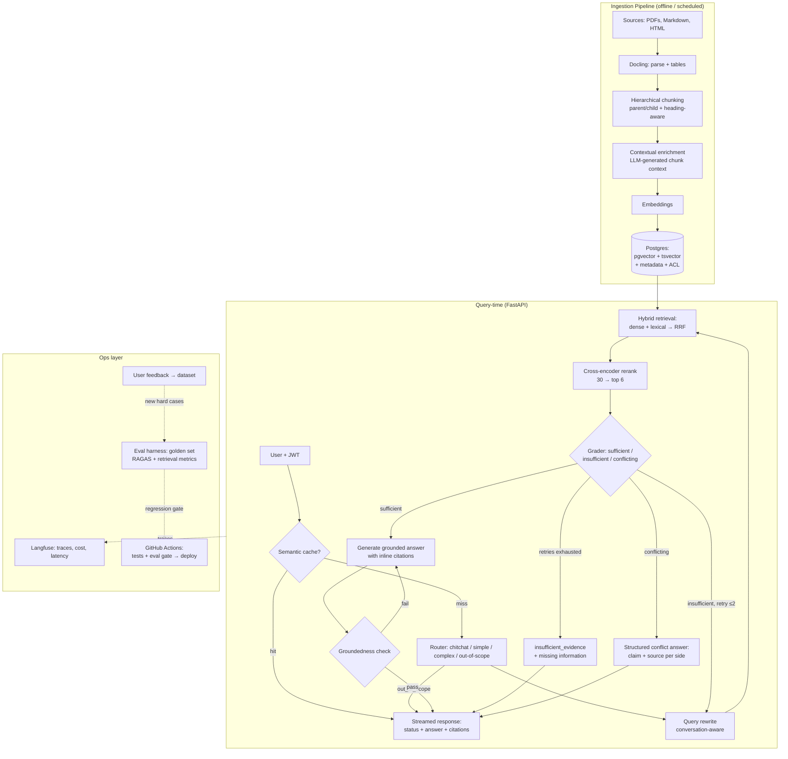

# Enterprise Knowledge Copilot — An End-to-End Advanced RAG Project — v2

> An internal knowledge assistant for companies: it answers employee questions from company documents (policies, technical guides, PDF reports containing tables), with **document-level permissions**, **citations**, an **explicit answer contract (including source-conflict detection)**, **Arabic/English measured per-language**, **automated evaluation**, and a **real deployment**.

This is the most widespread RAG use case in large enterprises, and at the same time the richest learning project you can build: every advanced technique has a natural place in it.

> **What's new in v2** (merged from AtlasRAG): (1) a five-status **answer contract** — `answered / insufficient_evidence / conflicting_evidence / access_restricted / out_of_scope` — with source-conflict detection as a feature measured against conflicts deliberately planted in the corpus; (2) **Arabic as first-class**: a fixed portion of the corpus and the golden set is Arabic, and every metric is reported overall/EN/AR; (3) the deliberate **access_restricted** decision (Phase 6); (4) **version-aware retrieval** added as the first stretch goal. Everything else is unchanged: same 9 phases, same stack, same philosophy.

**The project's core philosophy (this is what separates the professional from the hobbyist):**
1. **Evaluation first** — you build the measurement system before you build any improvement. Every change afterwards becomes a measurable number, not "it feels better now." The teams that succeed with RAG in production are the ones that built the eval infrastructure before anything else.
2. **A simple baseline, then measured improvements** — you start with Naive RAG, and each phase adds one technique and measures its impact on the same golden dataset. That's how you actually learn what improves things and what's just hype.
3. **Production concerns from day one** — auth, permissions, caching, observability, CI/CD. These are what make the project "enterprise-grade" rather than a demo.
4. **An explicit answer contract** — every answer from the system carries one `status` out of five: `answered` / `insufficient_evidence` / `conflicting_evidence` / `access_restricted` / `out_of_scope`. Correct refusal and detecting conflicts between sources aren't edge cases handled by one line in a prompt — they're first-class features with their own response shape and their own numbers on the scoreboard.
5. **Arabic measured, not assumed** — a fixed portion of the corpus and of the golden questions is Arabic, and every metric is reported overall/EN/AR. Any technique that improves English while breaking Arabic gets exposed in the same eval run — this is a real competitive advantage in the market, and it can't be built without measurement.

---

## 1) Architectural Decisions (Tech Stack) — with Rationale

These are settled decisions, not a menu of options. Each one records why it was chosen and the alternative you'd switch to if the context changed:

| Layer | Decision | Why this one specifically | Alternative, and when |
|---|---|---|---|
| Language | **Python 3.12 + uv** | The default language of AI engineering; uv is the fastest package manager right now | — |
| API | **FastAPI (async) + SSE streaming** | The de facto standard for LLM services; async is essential for I/O-heavy workloads | — |
| Database | **Postgres + pgvector** (everything in one database: vectors + full-text + users + chat history + ACL) | Up to ~5–10M vectors this is the default choice in 2026; you learn real SQL for hybrid search instead of calling a ready-made API; and it's closest to enterprise reality (they already run Postgres) | **Qdrant** once volume grows or you need complex filtering at high performance — switching is easy because you'll have isolated the retriever behind an interface |
| Embeddings | **OpenAI text-embedding-3-large** to start | The safest good default; simple API so you can focus on the architecture | **BGE-M3** or **Qwen3-Embedding** self-hosted if you need strong Arabic content or on-prem — Qwen3 currently leads the multilingual benchmarks; and since Arabic is core to this project, run the comparison between them on the AR subset of the golden set (Phases 2–3) as a measured experiment, not a leaderboard decision |
| Lexical search | **Postgres full-text (tsvector)** with a per-language config (`arabic` / `english`) + Arabic normalization | Built in, sufficient, and you understand what's happening; Postgres's Arabic stemmer is basic, so normalization (stripping diacritics, unifying alif/ya/ta marbuta) is what carries the quality | Real BM25 via ParadeDB/pg_search if you need higher precision |
| Reranker | **Cohere Rerank 3.5** to start (API) | The easiest path to a large impact (cross-encoder) | **BGE-reranker-v2-m3** self-hosted (free + supports Arabic) once you build your own serving |
| LLM | **Via LiteLLM** (provider-agnostic): a strong model for answering (e.g. Claude Sonnet) + a cheap/fast model for grading and routing (e.g. Claude Haiku) | Separating the "expensive brain" from the "cheap labor" is the real production pattern — most of the system's calls are grading/routing, not answers | Any provider; see docs.claude.com for the API |
| Parsing | **Docling** | Open source and among the best at tables inside PDFs — tables are what break enterprise RAG systems | LlamaParse (paid) for the really hard cases |
| Orchestration | **LangGraph only for the agentic layer** — the retrieval logic itself is plain Python | LangGraph is the standard for stateful cyclic agents (v1.0 since late 2025); but building the data plane by hand (chunking/hybrid/rerank) is what actually teaches you | At work you'll encounter LlamaIndex as a data plane — once you're done here, read its docs and you'll find you already understand every one of its concepts because you built them |
| Evaluation | **RAGAS + metrics you write yourself** (hit rate, MRR, NDCG) | RAGAS for the generation metrics (reference-free); the retrieval metrics are simple and writing them yourself = real understanding | DeepEval / Phoenix evals |
| Observability | **Langfuse (self-hosted via Docker)** | Open source, hierarchical traces for every step, cost and latency, and it integrates with RAGAS for online evals | LangSmith (managed), Phoenix |
| Cache & rate limit | **Redis** (semantic cache + exact cache + rate limiting) | Semantic caching is among the first optimizations that actually save money in production | — |
| Frontend | **Next.js** simple chat UI: streaming + citation display + 👍/👎 feedback | The citations and feedback UI is part of "enterprise RAG," not a nice-to-have | Streamlit if you want to cut the UI time short |
| Deployment | **Docker Compose on a VPS** (Hetzner/DO) + **GitHub Actions CI/CD** with an **eval gate** | This is real, honest production for a solo project; the eval gate in CI is the detail that impresses any interviewer | Kubernetes as a stretch once everything works |

**An important decision to make starting today:** every external component (vector store, embedder, reranker, LLM) sits behind an interface (Python Protocol/ABC). That's what turns "swap pgvector for Qdrant" into two lines instead of a rewrite.

---

## 2) Overall Architecture



The ACL is filtered **before** the similarity search (a SQL condition on `allowed_roles`), not after generation — this is a fundamental security rule in enterprise RAG.

---

## 3) Repository Structure

```
enterprise-rag/
├── app/
│   ├── main.py                  # FastAPI app, lifespan, middleware
│   ├── api/
│   │   ├── chat.py              # POST /chat (SSE streaming)
│   │   ├── documents.py         # upload / list / delete / re-sync
│   │   ├── feedback.py          # 👍/👎 linked to trace_id
│   │   └── auth.py              # JWT login/refresh
│   ├── core/
│   │   ├── config.py            # pydantic-settings
│   │   ├── security.py          # JWT, password hashing
│   │   └── deps.py              # DI: current_user, db session
│   ├── ingestion/
│   │   ├── parsers.py           # Docling wrappers
│   │   ├── chunkers.py          # fixed / heading-aware / parent-child
│   │   ├── contextualizer.py    # contextual retrieval enrichment
│   │   ├── embedder.py          # EmbeddingProvider interface + impls
│   │   └── pipeline.py          # idempotent ingest (hash-based sync)
│   ├── retrieval/
│   │   ├── dense.py             # pgvector search
│   │   ├── lexical.py           # tsvector search
│   │   ├── fusion.py            # RRF (you write it yourself — ~15 lines)
│   │   ├── reranker.py          # Reranker interface + impls
│   │   └── retriever.py         # the unified interface + ACL filter
│   ├── agent/
│   │   ├── state.py             # LangGraph typed state
│   │   ├── nodes.py             # route/rewrite/retrieve/grade/generate/check
│   │   ├── graph.py             # StateGraph construction
│   │   └── prompts.py           # all prompts in one place (versioned)
│   ├── services/
│   │   ├── cache.py             # Redis semantic + exact cache
│   │   └── llm.py               # LiteLLM wrapper (strong/cheap models)
│   ├── schemas.py               # AnswerContract: status + answer + citations + conflicts
│   └── models/                  # SQLAlchemy: users, docs, chunks, convos, feedback
├── evals/
│   ├── golden_dataset.jsonl     # the golden questions (with lang and expected_status fields)
│   ├── planted_conflicts.md     # conflicts planted in the corpus — ground truth for detection
│   ├── generate_synthetic.py    # QA generation from chunks
│   ├── retrieval_metrics.py     # hit_rate@k, MRR, NDCG — by hand
│   ├── run_eval.py              # runs everything, emits a report + compares against baseline
│   └── reports/                 # results of every experiment (historical scoreboard)
├── frontend/                    # Next.js: chat + citations + status badges + conflict display + feedback
├── infra/
│   ├── docker-compose.yml       # dev: pg+pgvector, redis, langfuse
│   ├── docker-compose.prod.yml
│   ├── Dockerfile.api           # multi-stage
│   └── Caddyfile                # TLS reverse proxy
├── .github/workflows/
│   ├── ci.yml                   # ruff + mypy + pytest + eval gate
│   └── deploy.yml               # build → push → SSH deploy
├── scripts/                     # ingest.py, seed_users.py, backup.sh
├── tests/                       # unit + integration (testcontainers)
├── Makefile                     # make dev / ingest / eval / deploy
└── README.md                    # + architecture.md + decisions.md (ADRs)
```

The `decisions.md` file (Architecture Decision Records) — record every decision and its rationale there. In large companies this is standard, and in interviews it's gold.

---

## 4) Build Plan — 9 Phases

Every phase: **goal → what you learn → what you build → Definition of Done**. Durations assume someone working on this alongside a day job (~10 hours a week). Don't move to a phase before you've met the previous phase's DoD.

### Phase 0 — Foundations (1 week)

**You build:**
- The repo with the structure above, `uv` for dependencies, `ruff` + `mypy` + `pre-commit`.
- A `docker-compose.yml` containing: Postgres with the pgvector extension, Redis, Langfuse (self-hosted).
- Choosing the corpus — **this is an important decision**: you want documents that are realistically "dirty." Suggestion: 30–60 mixed files — (a) technical documentation in Markdown/HTML, (b) PDF reports containing **tables** (published annual reports, for example), (c) "company policy" files (write or generate them). **30–40% of the corpus in Arabic — this is not optional**: policies and guides in Arabic (generate them if needed), so that the per-language eval is meaningful from day one. And **plant 5–10 deliberate conflicts** between documents (an internal policy saying 30 days' notice and a client contract saying 60; two versions of the same policy with different numbers) and record them in `evals/planted_conflicts.md` — these are the ground truth for measuring conflict detection later.
- An initial schema: `documents`, `chunks (content, embedding vector, tsv tsvector, metadata jsonb, allowed_roles text[])`, `users`.

**DoD:** `make dev` brings up all services; a script reads a file and stores chunks in the DB.

---

### Phase 1 — Evaluation Harness First + Naive RAG Baseline (2 weeks) ⭐ the most important phase

This is the phase that separates your project from 95% of RAG projects on GitHub.

**You learn:** why eval comes before optimization; retrieval metrics from the inside; RAGAS and the logic of LLM-as-judge; how to build a golden dataset properly.

**You build:**
1. **A golden dataset (80–120 questions)** in JSONL: `{question, ground_truth_answer, source_chunk_ids, category, lang, expected_status}`.
   - ~60% **synthetic**: a script takes random chunks and asks an LLM to generate a question + answer from them (you know the ground truth chunk automatically).
   - ~40% **manual and hard**: multi-hop questions (the answer spans two documents), questions about **tables**, questions phrased with different wording than the text (semantic gap), questions containing literal terms/codes (where dense retrieval alone fails), and **15+ questions whose answer isn't in the documents at all** (to measure correct refusal — the most important category in the enterprise), and **10–15 questions on top of the planted conflicts** (`expected_status: conflicting_evidence`) — the question asks for the value, and the correct answer is to surface the conflict with both sides and their sources, not to pick one of them.
   - **~35% of the questions in Arabic**, distributed across all categories, including cross-lingual ones (an Arabic question whose answer is in an English document and vice versa) — these are what actually test multilingual embeddings, not the leaderboard.
2. **Retrieval metrics by hand** (`retrieval_metrics.py`): `hit_rate@k`, `MRR`, `NDCG@k`. All of them under 60 lines of Python. No off-the-shelf library here — the goal is understanding.
3. **Generation metrics via RAGAS**: faithfulness, answer relevancy, context precision/recall. And **status accuracy** which you compute yourself: the share of questions where the system returned the correct `expected_status` — especially for the unanswerable and conflicting categories.
4. **Naive RAG baseline**: fixed-size chunking (512 tokens, 15% overlap) → embedding → cosine top-5 → a simple prompt → answer.
5. `run_eval.py`: runs the full golden set, emits a report (JSON + Markdown table), and saves it under `evals/reports/` alongside the git commit hash. The report always has three breakdowns: **overall / EN / AR** (and per-category) — an aggregate number hides the collapse of an entire language.

**DoD:** a baseline table documented in the README. A realistic example of what you might see: hit_rate@5 ≈ 0.65, faithfulness ≈ 0.78, correct refusal ≈ 40% (naive hallucinates instead of saying "not found"), and conflict detection ≈ 0% (it grabs the first source and answers confidently as if there were no disagreement). These are the numbers you'll go on to "demolish" in the coming phases — and this is your interview story.

---

### Phase 2 — Ingestion Done Right: Parsing + Chunking + Contextual Retrieval (2 weeks)

**You learn:** why "garbage in, garbage out" accounts for 80% of enterprise RAG problems; chunking strategies; the Contextual Retrieval technique.

**You build:**
1. **A Docling pipeline**: PDF → structured document; tables come out as Markdown tables stored as dedicated chunks with `type=table` metadata plus an LLM-generated descriptive sentence.
2. **Heading-aware hierarchical chunking**: split on headings, and store **parent/child**: a small child (~300 tokens) for search, a parent (the full section) for the context handed to the LLM.
3. **Contextual Retrieval** (the Anthropic technique): before storing each chunk, a cheap LLM generates a line or two of context ("this passage is from section X of document Y and discusses...") that gets prepended to the text and included in the embedding. It reduces retrieval failures noticeably, especially for chunks that lose their meaning outside their context.
4. **Idempotent ingestion**: a hash per file; re-running doesn't reprocess what hasn't changed; chunks of deleted files get removed.
5. **Rich metadata**: `source, section_path, doc_type, updated_at, allowed_roles, lang`.
6. **Arabic-aware lexical indexing**: set `lang` for each chunk (the document's language or simple detection), and build the tsvector with the right language config (`arabic` / `english`). Before indexing, run a normalization pipeline for Arabic: strip diacritics and tatweel, unify the alif forms (أ / إ / آ → ا), alif maqsura (ى → ي), and ta marbuta → ha — **in the index only**; the displayed text stays original. Measure the impact on the AR subset: typically a clear jump in lexical recall, because without it "الموظّفين" and "الموظفين" are two different words to the index.

**DoD:** a new eval run comparing: fixed-size vs heading-aware vs heading-aware+contextual — three rows on the scoreboard with the deltas, each row split EN / AR. Expect a clear jump in hit rate from the contextual step.

---

### Phase 3 — Advanced Retrieval: Hybrid + Reranking + Parent-Child (2 weeks)

**You learn:** why dense-only lost; RRF; the fundamental difference between bi-encoder and cross-encoder; the retrieve-small-read-big pattern.

**You build:**
1. **Hybrid search**: dense (pgvector `<=>`) + lexical (tsvector `ts_rank`), each returning top-20, merged with **Reciprocal Rank Fusion** that you write yourself:

```python
def rrf(result_lists: list[list[str]], k: int = 60) -> list[str]:
    scores: dict[str, float] = {}
    for results in result_lists:
        for rank, doc_id in enumerate(results):
            scores[doc_id] = scores.get(doc_id, 0.0) + 1.0 / (k + rank + 1)
    return sorted(scores, key=scores.get, reverse=True)
```

   Try it on the eval and see what happens with the literal-term questions — those are the ones that were breaking dense retrieval.
2. **Reranking**: hybrid returns 30 candidates → a cross-encoder (Cohere Rerank) reorders them → only the top 6 enter the context. Measure the difference in MRR and context precision.
3. **Parent-child for real**: search over children, and the LLM receives the parents after dedupe.
4. **A unified retriever interface**: `retrieve(query, user_roles, k) -> list[RetrievedChunk]` — with the ACL filter inside it from now on.

**DoD:** the scoreboard shows the impact of each addition on its own (hybrid alone, then +rerank). What published experiments suggest: hybrid is the single biggest improvement over naive, and the reranker adds another clear MRR gain on top of it. Target hit_rate@5 ≥ 0.85 by this point.

---

### Phase 4 — Query Intelligence: Routing + Rewriting + Decomposition (1–2 weeks)

**You learn:** Adaptive RAG (why not every question should take the same path); handling conversation context; when the "fancy" techniques don't help.

**You build:**
1. **A router** (cheap LLM, structured output): classifies the question as `chitchat` (direct reply with no retrieval), `simple` (fast path: hybrid+rerank+generate), `complex` (the agentic path in the next phase), or `out_of_scope` (a polite refusal — the first status of the answer contract gets settled here). This is what keeps latency reasonable: easy questions in seconds, and only the hard ones take the long path.
2. **Conversation-aware rewriting**: "OK, and what about the year before?" has to be turned into a standalone question before retrieval, using the conversation history.
3. **Query decomposition** for multi-hop: "Compare the leave policy between the Jordan branch and the UAE branch" → two sub-questions → retrieval for each → merge.
4. **HyDE as a measured experiment**: generate a hypothetical answer and search with its embedding. **Important note:** sometimes it doesn't help — or even hurts — when a strong reranker is in place, and that's a valuable result in itself: "I tried HyDE, measured it, it added nothing, I removed it" is an excellent interview line.

**DoD:** the multi-hop questions in the golden set improve noticeably; a latency table per path (simple ≈ ≤ 3s).

---

### Phase 5 — The Agentic Layer with LangGraph: Self-Correcting RAG (2 weeks) ⭐

**You learn:** the move from a linear pipeline to a **cyclic state machine**; the CRAG and Self-RAG patterns in practice; balancing quality against latency and cost.

**You build** — the StateGraph:

```python
class AnswerStatus(StrEnum):
    ANSWERED = "answered"
    INSUFFICIENT_EVIDENCE = "insufficient_evidence"
    CONFLICTING_EVIDENCE = "conflicting_evidence"
    ACCESS_RESTRICTED = "access_restricted"   # internal/audit — see the Phase 6 note
    OUT_OF_SCOPE = "out_of_scope"

class Conflict(TypedDict):
    claim_a: str
    source_a: Citation
    claim_b: str
    source_b: Citation

class RAGState(TypedDict):
    question: str
    rewritten_question: str
    route: str                    # chitchat | simple | complex | out_of_scope
    documents: list[RetrievedChunk]
    generation: str
    citations: list[Citation]
    status: AnswerStatus
    conflicts: list[Conflict]        # populated when the status is conflicting
    missing_information: list[str]   # populated when the status is insufficient
    retries: int                  # hard ceiling: 2
    grade_notes: str

# route → rewrite → retrieve → grade_documents
#   ├─ sufficient   → generate → check_groundedness ─ pass → answered
#   │                                └─ fail (once only) → regenerate
#   ├─ conflicting  → build_conflict_answer → conflicting_evidence (both sides + recommended_action)
#   └─ insufficient → rewrite_query → retrieve (loop, retries ≤ 2)
#                        └─ retries exhausted → insufficient_evidence + exactly what information is missing
```

1. **Grader node** (cheap LLM): instead of yes/no, it classifies the evidence into three states: `sufficient` / `insufficient` / `conflicting`. If insufficient → it rewrites the question and goes back to retrieval (at most two attempts — always strict budgets). `conflicting` fires when two relevant sources give contradictory values for the same requested fact (a duration, a number, a condition, an entitlement).
2. **Generate with citations**: the prompt forces every claim to be attributed to `[1] [2]` linked to chunks; the API returns the citations with their metadata (file name + section) for display in the UI.
3. **Groundedness checker**: a node that verifies every sentence in the answer is supported by the context. If there are unsupported claims → regenerate once, and if they persist → strip the unsupported parts.
4. **Structured conflict answer**: when the status is `conflicting_evidence`, the answer isn't free text trying to "reconcile" the sources — it's an explicit object:

```json
{
  "status": "conflicting_evidence",
  "summary": "There are two different requirements for the notice period.",
  "conflicts": [
    { "claim": "30 days", "source": "Internal Policy v4.1 — section 7.2" },
    { "claim": "60 days", "source": "Client Contract — section 8.2" }
  ],
  "recommended_action": "Escalate to legal"
}
```

   And the UI displays both sides next to each other. This is the feature that separates the project from any "chat with docs": naive systems pick one source and answer confidently — and you have baseline numbers proving it.
5. **Correct refusal as a first-class feature**: `insufficient_evidence` with explicit `missing_information` ("I'm missing: the data classification, the receiving party") is far better than a confidently wrong answer — in companies this is the difference between a system that goes to production and one that gets pulled a week later.

**DoD:** the "unanswerable questions" category in the golden set: correct refusal ≥ 95% (it was ~40% at baseline). The planted-conflicts category: detection ≥ 80% (it was ~0%). Overall status accuracy ≥ 90%. RAGAS faithfulness ≥ 0.9. Document the extra latency/cost of the agentic path versus the simple path — this is the trade-off you need to be able to discuss knowingly.

---

### Phase 6 — Production API: Auth + ACL + Caching + Streaming (2 weeks)

**You learn:** the difference between a script and a service; why document-level security is essential (it's what sinks enterprise RAG projects when it's forgotten); semantic caching.

**You build:**
1. **Auth**: JWT (access + refresh), users with roles (`hr`, `engineering`, `finance`, `admin`).
2. **Document-level ACL** — the golden rule: filtering happens **inside** the retrieval query itself:

```sql
SELECT id, content, 1 - (embedding <=> :query_emb) AS score
FROM chunks
WHERE allowed_roles && :user_roles      -- before the similarity, not after generation
ORDER BY embedding <=> :query_emb
LIMIT 20;
```

   And write a **test** proving an engineering employee can't reach an HR document even when asking about it directly.
3. **SSE streaming** from the agent graph to the UI (with intermediate events: "searching…", "found 6 sources…").
4. **Redis caching**: exact cache + **semantic cache** (embed the question; if cosine ≥ ~0.95 against a stored question for the same user permissions → return the answer immediately). Measure the hit rate and the savings.
5. **Conversations + messages** in the DB, per-user rate limiting, structured logging (JSON) with a `request_id`.
6. **Protection against indirect prompt injection**: uploaded documents are the primary attack vector in RAG systems — separate "instructions" from "retrieved content" clearly in the prompt, treat any commands inside documents as text to display rather than execute, and define exactly what the agent is allowed to do.
7. **The `access_restricted` decision — document it as an ADR**: when retrieval comes back empty **because of** the ACL (the document exists but the user isn't authorized), the default response to the user is the same as the `insufficient_evidence` response — because replying "there is a document but it's hidden from you" is itself information disclosure (it confirms to them that a confidential document exists on exactly that topic). Detecting it technically is simple: if the filtered retrieval returns empty, run a count query without the ACL filter — if there are results, record `access_restricted` in the trace and the audit log only (and it shows up in the admin view). Few people notice this point — an interview gold mine.

**DoD:** `docker compose up` brings the whole system up; an E2E scenario: log in → ask → streaming → citations → follow-up question → cache hit on repeat; the ACL test is green; and the access_restricted test: an engineering user asks about an HR document → the UI returns insufficient_evidence and the audit log records access_restricted.

---

### Phase 7 — Observability + the Continuous Improvement Loop (1–2 weeks)

**You learn:** what distinguishes a mature team: the ability to diagnose "why was this answer bad" in a minute instead of an hour, and to turn user feedback into measured improvements.

**You build:**
1. **Langfuse tracing** for every request: a hierarchical trace with spans for each node (route, retrieve, rerank, grade, generate) with inputs/outputs, tokens, cost, latency. Any strange answer → open the trace and see where it broke: did retrieval bring back the wrong thing? Did the grader let something through that it shouldn't have? The prompt?
2. **Feedback loop**: 👍/👎 plus a comment from the UI, stored linked to the `trace_id`.
3. **Online evaluation**: a periodic job that samples production traces and runs RAGAS on them (reference-free — no ground truth needed) and records the scores in Langfuse. Also track the **weekly distribution of statuses**: a sudden spike in `insufficient_evidence` means ingestion broke or the corpus went stale — a free operational signal.
4. **A weekly ritual** (write it in the README as a runbook): open the week's worst 10 traces (👎 or low faithfulness) → diagnose → fix → add the hard cases to the golden set → eval → deploy. This is "the loop" that makes the system improve instead of rot.

**DoD:** you can answer within minutes: what's the average cost per question? What's the P50/P95 latency for each path? Which type of question fails most?

---

### Phase 8 — Deployment + CI/CD with an Eval Gate (1–2 weeks)

**You build:**
1. **Multi-stage Dockerfiles** (a small final API image, non-root user).
2. **CI (GitHub Actions)** on every PR: `ruff` + `mypy` + `pytest` + **the eval gate**: run a subset of the golden set (~30 questions for speed) and fail the PR if faithfulness or hit rate drops more than 2–3% below main. **RAG quality becomes a regression test** — engineering-wise this is the strongest idea in the whole project.
3. **CD**: merge to main → build & push images (GHCR) → SSH deploy to the VPS → health check → notification.
4. **VPS setup**: Caddy (automatic TLS) in front of the API and the frontend; `docker-compose.prod.yml`; daily backups (`pg_dump` → object storage); a `/health` endpoint and simple uptime monitoring.
5. **Secrets** via environment / GitHub secrets — not a single secret in the repo.

**DoD:** a live system on a real domain over HTTPS; a push to main reaches production on its own once the gates pass; document in the README: "how a change travels from commit to production."

---

## 5) Stretch Goals (after the foundation is finished — in order)

1. **Version-aware retrieval**: a `document_versions` table with effective dates, filtering to "the version currently in force" by default, and a dedicated route for diff questions ("what changed in the remote-work policy between 2024 and 2026?"). A natural extension of the answer contract — a conflict between an old and a new version is a special case of `conflicting_evidence` — but it adds real schema complexity, so its place is after the foundation is solid.
2. **GraphRAG module**: extract entities/relations from the documents and build a knowledge graph (start with Postgres tables before Neo4j), and route relational questions ("who depends on what") to it. Gartner ranks it among the most important trends for 2026, and published numbers show a tangible accuracy improvement in specialized domains — but the complexity cost is real, so it's a measured addition, not a starting point.
3. **Multimodal retrieval (ColPali-style)**: visual search over the PDF pages themselves — it solves the table and figure problems at the root.
4. **Fine-tuned embeddings**: take pairs from production feedback, fine-tune an open embeddings model (sentence-transformers), and measure the difference on the golden set — and this is the clearest opportunity to close the Arabic gap if any remains.
5. **Kubernetes**: move the compose setup to a Helm chart on a small cluster (k3s) with HPA — but only after you have something working to move.

---

## 6) Target Numbers (Final Scoreboard)

| Metric | Baseline (expected) | Final target |
|---|---|---|
| hit_rate@5 (retrieval) | ~0.60–0.70 | **≥ 0.90** |
| MRR | ~0.45–0.55 | **≥ 0.75** |
| RAGAS Faithfulness | ~0.75–0.80 | **≥ 0.90** |
| RAGAS Answer Relevancy | ~0.75 | **≥ 0.85** |
| Correct refusal (unanswerable questions) | ~40% | **≥ 95%** |
| Conflict detection (planted conflicts) | ~0% | **≥ 80%** |
| Status accuracy (all categories) | — | **≥ 90%** |
| hit_rate@5 gap between EN and AR | often 10+ points | **≤ 5 points** |
| P50 latency — simple path | — | **≤ 3s** |
| P50 latency — agentic path | — | **≤ 12s** |
| Cache hit rate (after realistic usage) | 0% | **≥ 20%** |

The thresholds of faithfulness ≥ 0.9 and relevancy ≥ 0.85 are in fact the commonly used thresholds in production systems, not cosmetic numbers. And the language gap is itself a KPI: if a technique widened it, that's information that goes on the scoreboard rather than getting buried.

---

## 7) How to Talk About the Project in an Interview (the value summary)

- "I built the **eval harness before** I built the improvements — I have a historical scoreboard documenting the impact of every technique in numbers on the same golden set."
- "Hybrid search + RRF was the single biggest improvement; cross-encoder reranking added X MRR points on top of it — and I can show you the report."
- "I tried HyDE, measured it, it added nothing with the reranker in place, so I removed it" — measured removal is a stronger maturity signal than addition.
- "Correct refusal is a measured feature for me: from 40% to 95%+ via a grading loop and a groundedness check."
- "The ACL is enforced inside the retrieval query and has tests — not post-filtering."
- "Every answer conforms to a 5-status answer contract; source conflicts come back structured with both sides and their sources — and I have measured recall on planted conflicts: from 0% to 80%+."
- "Every metric is reported overall/EN/AR — I can show you exactly what each technique cost Arabic, and how I closed the gap to under 5 points."
- "`access_restricted` is a documented information-disclosure decision as an ADR: the user gets insufficient_evidence, and the audit trail knows the truth."
- "RAG quality is a regression test in my CI: any PR that lowers faithfulness is rejected automatically."
- "Every request has a full Langfuse trace: I can diagnose any bad answer in minutes and know the cost per question."

---

## 8) Core Resources (read them in phase order)

- **Anthropic — Contextual Retrieval**: anthropic.com/news/contextual-retrieval (Phase 2)
- **Docling docs**: docling-project.github.io/docling (Phase 2)
- **pgvector**: github.com/pgvector/pgvector (Phases 0–3)
- **RAGAS docs**: docs.ragas.io (Phase 1)
- **LangGraph docs + their RAG tutorials** (CRAG / Self-RAG / Adaptive RAG ready-made examples): langchain-ai.github.io/langgraph (Phases 4–5)
- **The papers behind the patterns**: Self-RAG (Asai et al. 2023), CRAG (Yan et al. 2024), HyDE (Gao et al. 2022), RRF (Cormack et al. 2009)
- **Langfuse self-hosting + RAGAS integration**: langfuse.com/docs (Phase 7)
- **Claude API** (if you use it as a provider): docs.claude.com
- **Microsoft GraphRAG**: microsoft.github.io/graphrag (stretch)

---

## A Final Note

The biggest temptation will be to jump to the agentic layer in the first week because it's "the fun part." Resist it. A system built in the order above leaves you understanding **why** each layer exists — and that is exactly the difference between someone who "used a LangGraph tutorial" and someone who can design a RAG system for a company from scratch and defend every decision in it with numbers.