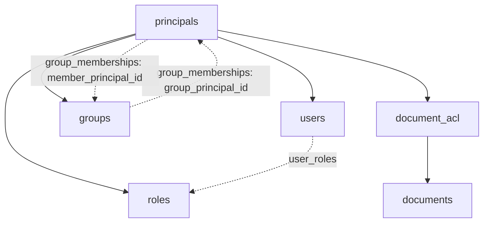
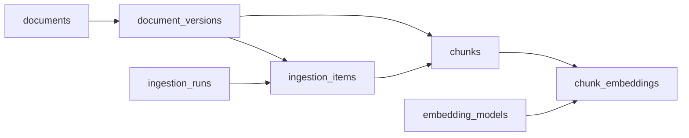

# AtlasRAG Schema Overview

This document gives a conceptual view of the AtlasRAG data model. It is intended
for orientation and architecture discussions, not as a substitute for the
column-level entity-relationship diagram.

For columns, data types, and the complete relationship view, see
[schema-erd.png](schema-erd.png).

## Schema map

The broader model is organized into four database schemas. The inventory is
kept here so that the planned model is visible in one place; the current ERD
image does not yet show every table in this inventory.

| Schema | Responsibility | Tables | Current ERD coverage |
| --- | --- | --- | --- |
| `iam` | Identity, roles, groups, and authentication state | `principals`, `users`, `user_identifiers`, `roles`, `groups`, `user_roles`, `group_memberships`, `auth_sessions`, `refresh_tokens` | Core identity, role, and group tables are shown; identifier and session tables are not shown. |
| `knowledge` | Documents, access control, ingestion, chunking, and embeddings | `documents`, `document_acl`, `document_versions`, `document_artifacts`, `ingestion_runs`, `ingestion_items`, `chunks`, `embedding_models`, `chunk_embeddings` | Core document, ACL, ingestion, chunk, and embedding tables are shown; `document_artifacts` is not shown. |
| `rag` | Conversations, answer runs, citations, conflicts, and feedback | `conversations`, `messages`, `answer_runs`, `answer_citations`, `answer_missing_information`, `answer_conflicts`, `answer_conflict_claims`, `feedback` | Not shown. |
| `audit` | Security and operational history | `audit_events` | Not shown. |

The diagrams in this document describe conceptual associations. The ERD is
authoritative for the relationships that are currently implemented.

### Schema tree

```text
iam
├── principals
├── users
├── user_identifiers
├── roles
├── groups
├── user_roles
├── group_memberships
├── auth_sessions
└── refresh_tokens

knowledge
├── documents
├── document_acl
├── document_versions
├── document_artifacts
├── ingestion_runs
├── ingestion_items
├── chunks
├── embedding_models
└── chunk_embeddings

rag
├── conversations
├── messages
├── answer_runs
├── answer_citations
├── answer_missing_information
├── answer_conflicts
├── answer_conflict_claims
└── feedback

audit
└── audit_events
```

## Identity and authorization

`principals` is the shared identity type for users, roles, and groups. Access
grants target principals, which allows the authorization model to support
direct user access as well as access inherited through roles or groups.



The effective access path for a user is therefore conceptually:

```text
user
├── direct principal grant ───────────────┐
├── user_roles → role principal grant ────┼──→ document_acl → document
└── group_memberships → group grant ──────┘
```

The broader IAM inventory also includes `user_identifiers`, `auth_sessions`,
and `refresh_tokens`. These tables are not currently represented in the ERD,
so their exact foreign keys and lifecycle relationships should be documented
when they are added to the diagram.

## Knowledge and retrieval pipeline

The knowledge model represents source documents and the derived data produced
while preparing them for retrieval:



This is a conceptual processing path based on the relationships currently
shown in the ERD. It is not a strict one-to-many pipeline: ingestion runs and
embedding models are independent inputs to the derived records they produce.
`document_artifacts` is part of the broader inventory but is not yet shown in
this pipeline or in the ERD.

## Conversations and answers

The `rag` schema stores conversational context, generated answer runs,
supporting evidence, missing-information records, conflicts, and feedback.
These tables are part of the broader inventory but are not currently shown in
the ERD. Their foreign-key relationships should be added to the diagram when
the RAG schema is implemented.

`answer_citations`, `answer_missing_information`, and the conflict tables are
intended to represent answer-level output rather than source-of-truth
document content.

## Auditability

`audit_events` is intended to hold security- and operation-relevant history
across identity, knowledge, and RAG workflows. It is not currently shown in the
ERD; event payload, references, and retention policy are defined elsewhere.

## Model invariants

The following invariants define the identity and authorization model.

### Principal identity

1. `principals.id` is immutable.
2. `principals.type` is immutable.
3. Every principal has exactly one specialization matching its type.
4. Every user, role, and group has exactly one principal.
5. Specialization consistency is guaranteed at transaction commit.
6. Only active, non-deleted principals participate in authorization resolution.

### Identifiers

1. Users do not own email uniqueness directly; login and identity identifiers
   have their own lifecycle.
2. An active identifier value is unique within its identifier type.
3. Historical identifier values are preserved.
4. `role_key` is globally stable and is never reused.
5. `group_key` is globally stable and is never reused.

### Roles

1. User-to-role assignment is many-to-many through `user_roles`.
2. Roles are flat in v1; role hierarchy and inheritance are not supported.
3. In v1, roles may be assigned directly only to users.

### Groups

1. A group member may be a user or another group.
2. A role may not be a group member.
3. The group membership graph is acyclic.
4. Direct self-membership is rejected by a local constraint.

### Timestamps and authorization state

1. `principals.status_changed_at` tracks lifecycle-state changes.
2. A specialization's `updated_at` tracks changes to specialization data.
3. `updated_at` is not used to define authorization-cache invalidation
   semantics.

## Referential actions

The following referential-action decisions define how dependent records behave
when a parent record is deleted. `CASCADE` describes physical deletion; normal
application flows may still use soft deletion where noted.

| Relation | Decision |
| --- | --- |
| Principal → user/role/group specialization | `CASCADE` on hard purge only |
| User → identifiers | `CASCADE` |
| User/role → `user_roles` | `CASCADE` |
| Group/member → `group_memberships` | `CASCADE` |
| Actor fields | `SET NULL` |
| User → `auth_sessions` | `CASCADE` |
| Session → `refresh_tokens` | `CASCADE` |
| Document → ACL | `CASCADE` |
| Document → versions | `CASCADE` physically; normal flow uses soft delete |
| Version → artifacts | `CASCADE` |
| Artifact → `ingestion_items` | `CASCADE` |
| `ingestion_items` → chunks | `CASCADE` |
| Chunk → embeddings | `CASCADE` |
| Parent chunk → child relationship | `RESTRICT` |
| Chunk → historical citation | **`RESTRICT`** |
| Conversation → messages | `CASCADE` |
| Conversation → answer runs | `CASCADE` |
| Answer run → citations/missing/conflicts/feedback | `CASCADE` |
| Conflict → claims | `CASCADE` |
| Actor → audit event | `SET NULL` |

## Reading the diagrams

- Solid arrows represent a conceptual dependency or data flow.
- Dashed arrows represent relationship tables or membership paths.
- Table names are shown exactly as they appear in the database model.
- Diagram arrows are intentionally simplified; use the ERD for foreign-key
  direction, optionality, and cardinality.
