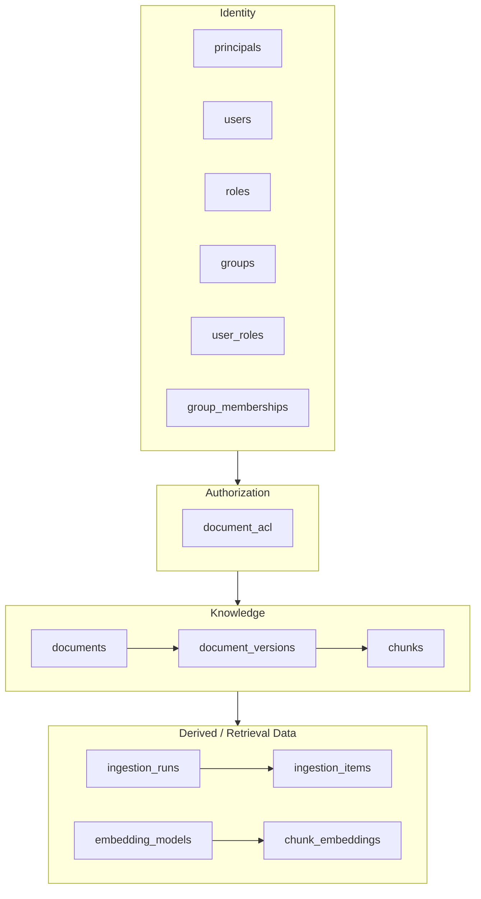
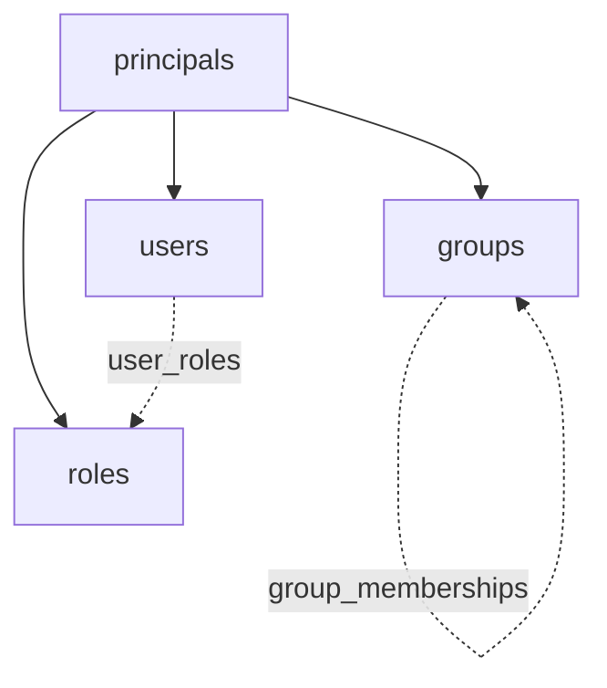
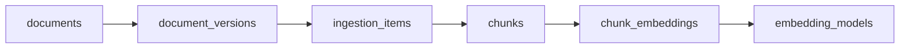
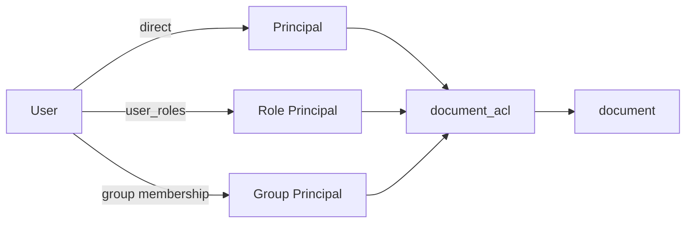

# AtlasRAG Data Model — Conceptual Overview

Simplified, conceptual views of the schema. For the full entity-relationship
diagram with columns and types, see [schema-erd.png](schema-erd.png).

## Layers

The schema is organized into four conceptual layers, each building on the one
above it.



## Principal Hierarchy

`principals` is the shared identity type behind users, roles, and groups —
every grant of access ultimately points back to a principal.



## Knowledge Chain

Each document flows through versioning, ingestion, chunking, and embedding
in a strict 1:N pipeline.



## Access Resolution

How a user's effective permission on a document is resolved: directly, via
a role, or via group membership — always mediated by `document_acl`.


```bash 
                        principals
                    /       |       \
                   /        |        \
                users     roles     groups
                  │          ▲          ▲
                  │          │          │
                  └──── user_roles      │
                                        │
                                group_memberships
                                 ▲             │
                                 └──── group ──┘
```